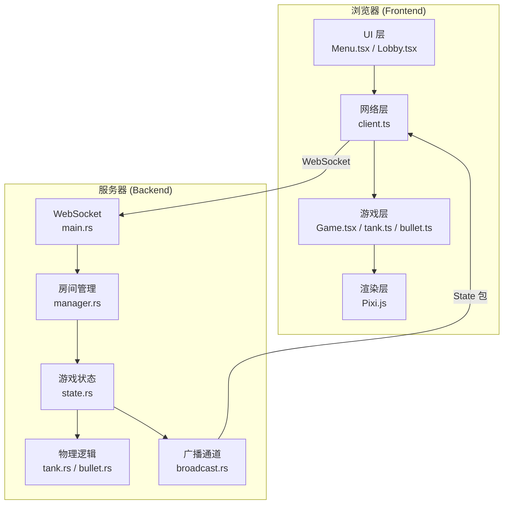
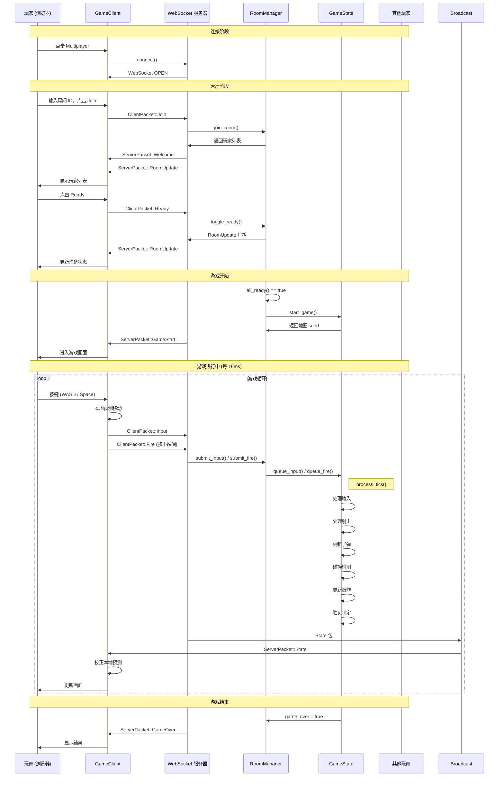
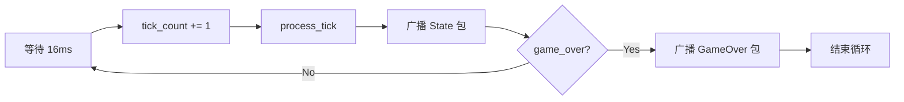
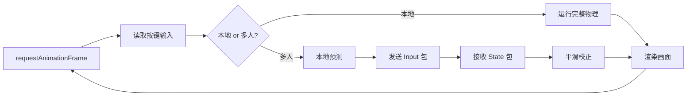
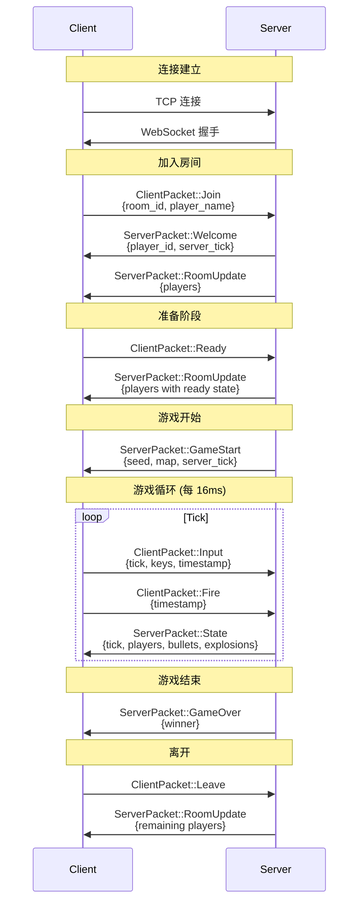
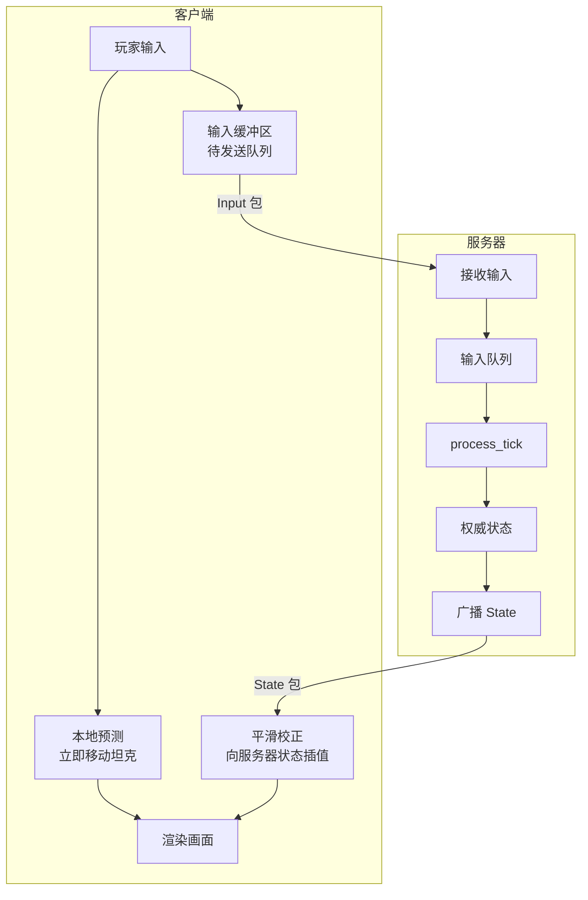
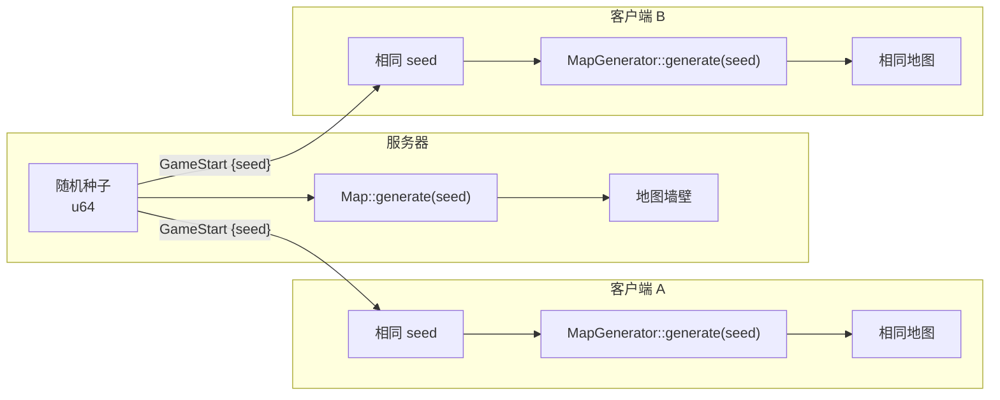

# Architecture Documentation / 架构文档

> 本文档面向有语言基础但无游戏开发经验的开发者。
> 不解释语法，只解释**系统架构**、**数据流**和**设计决策**。

---

## Table of Contents / 目录

1. [System Overview / 系统概览](#system-overview)
2. [Data Flow / 数据流](#data-flow)
3. [Game Loop Architecture / 游戏循环架构](#game-loop-architecture)
4. [Network Protocol / 网络协议](#network-protocol)
5. [Authority & Prediction / 权威与预测](#authority--prediction)
6. [Map Synchronization / 地图同步](#map-synchronization)
7. [State Snapshots / 状态快照](#state-snapshots)

---

## System Overview / 系统概览

本项目采用 **Client-Server 架构**，服务器拥有最终权威（Authoritative Server），客户端做预测和渲染。



---

## Data Flow / 数据流

### 多人游戏完整数据流



---

## Game Loop Architecture / 游戏循环架构

### 权威服务器循环



**关键参数**：
- **Tick Rate**: 62.5 TPS（每 tick 16ms）
- **为什么是 62.5**：16ms 是 60fps 显示器的约一帧时间，与前端渲染频率对齐，减少视觉撕裂感。
- **时间计算**: `current_time = tick_count * 16`，简化设计，避免频繁调用系统时钟。

### 前端游戏循环



**本地预测 vs 服务器权威**：

| 步骤 | 本地模式 | 多人模式 |
|------|---------|---------|
| 输入响应 | 立即处理 | 立即预测 + 发送服务器 |
| 碰撞检测 | 前端计算 | 服务器计算，前端显示 |
| 死亡判定 | 前端判断 | 服务器判断，前端同步 |
| 画面更新 | 本地物理驱动 | 服务器 State 包驱动 |

---

## Network Protocol / 网络协议

### 协议包序列图



### 序列化格式

当前使用 **JSON over WebSocket Binary Frames**：

```
Client: TextEncoder().encode(JSON.stringify({type: "Input", ...}))
        → WebSocket Binary Frame

Server: serde_json::to_vec(&ServerPacket::State {...})
        → WebSocket Binary Frame

Client: new TextDecoder().decode(ArrayBuffer)
        → JSON.parse() → ServerPacket
```

**为什么用 Binary Frames 传 JSON**：
虽然内容还是 JSON 字符串，但使用 Binary Frame（Opcode 0x2）而非 Text Frame（Opcode 0x1）。这是为了未来兼容 Postcard 二进制格式：服务器和客户端现在按 Binary 处理，将来切换到 Postcard 时无需修改 WebSocket 框架代码。

---

## Authority & Prediction / 权威与预测

### 客户端预测 + 服务器校正



**为什么需要客户端预测**：

假设没有预测，玩家按 `W` 后需要：
1. 发送 Input 包到服务器（网络延迟 50ms）
2. 服务器处理（16ms tick）
3. 服务器广播 State 包（50ms）
4. 客户端渲染（总计约 116ms 延迟）

**116ms 的按键延迟会让游戏感觉"黏滞"**。客户端预测允许前端立即响应输入，将延迟降至接近零。

**为什么需要服务器校正**：
如果不校正，客户端的预测会逐渐偏离服务器权威状态（如网络抖动导致输入丢失）。平滑校正（`correctionSpeed = 0.15`）在"快速修正"和"流畅体验"之间取得平衡。

### 校正可视化

```
时间轴 →

客户端预测位置:    ●────●────●────●────●
                         ↘ 轻微偏差
服务器权威位置:          ●────●────●────●
                              ↘ 平滑校正 (15%/帧)
最终显示位置:              ●───●───●───●───●
                              ↑
                         既快速修正又不跳变
```

---

## Map Synchronization / 地图同步

### Seed-Based Generation



**为什么用种子同步**：

| 方案 | 数据量 | 优点 | 缺点 |
|------|--------|------|------|
| 发送完整墙壁 | ~5KB | 简单直接 | 网络开销大，延迟高 |
| 发送种子 (u64) | 8 字节 | 极小开销，极快同步 | 需要确定性随机算法 |

使用 **seed-based generation** 将地图同步开销从数千字节降至 8 字节，减少 99%+ 的网络传输。关键前提是**前后端使用相同的随机算法和生成逻辑**：
- 后端：`rand::rngs::StdRng::seed_from_u64(seed)`
- 前端：`Math.random()` 无法种子化，所以前端本地模式不使用种子同步（直接用 `Math.random()`），多人模式从服务器接收 seed 后目前也直接用服务器下发的完整墙壁数据（见 `Game.tsx` 中 `props.serverWalls`）。

**注意**：当前实现中，前端多人模式实际接收的是 `GameStart { map: MapData }` 包，包含完整墙壁数据，而非仅 seed。这是因为前端暂未实现 seed-based 的 MapGenerator。优化方向是前端也实现确定性随机，改为仅接收 seed。

---

## State Snapshots / 状态快照

### 快照内容

每 tick 广播的 State 包包含：

```json
{
  "type": "State",
  "tick": 1234,
  "players": [
    {
      "id": "...",
      "x": 150.5,
      "y": 200.3,
      "rotation": 1.57,
      "is_dead": false,
      "shots_remaining": 8
    }
  ],
  "bullets": [
    {
      "id": 42,
      "x": 180.0,
      "y": 220.0,
      "direction": 1.57,
      "active": true
    }
  ],
  "explosions": [
    {
      "id": 7,
      "x": 200.0,
      "y": 200.0,
      "progress": 0.35
    }
  ]
}
```

### 快照大小估算

| 数据 | 4 人场景 | 估算大小 |
|------|---------|---------|
| 4 PlayerSnapshot | 4 × ~80 bytes | ~320 bytes |
| 40 BulletSnapshot | 40 × ~50 bytes | ~2000 bytes |
| 4 ExplosionSnapshot | 4 × ~40 bytes | ~160 bytes |
| JSON 开销 | - | ~500 bytes |
| **总计** | - | **~3KB/包** |

以 62.5 TPS 计算：
- 每秒数据量：3KB × 62.5 = **187.5 KB/s**
- 4 个玩家同时接收：187.5 × 4 = **750 KB/s 上行带宽**

**当前可接受**，但未来扩展至 16 人或更多子弹时需要优化：
1. **Delta Compression**：只发送变化的部分（如只移动了的玩家）
2. **Binary Protocol**：Postcard 序列化可减少 50-70% 大小
3. **Interest Management**：只发送玩家视野内的实体

---

*Last updated: 2026-05-02*
